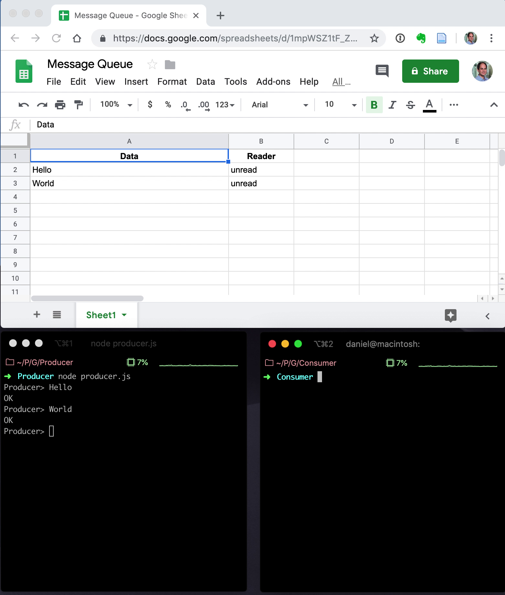

Message Queue in Google Apps Script
===================================

Implementation of a Message Queue in Google Apps Script.

[Google Apps Script] is an environment for light-weight application development
around Google's G Suite set of tools. It runs JavaScript on the server side and
provides access to the [Spreadsheet] for example. Scripts can be exposed as
[Web App] and return arbitrary text-content as part of the [Content Service].

Can Google Apps Script therefore be used to build a web application backend?
This proof-of-concept shows an implementation of a message queue, using a
spreadsheet for persistence and a HTTP API for access. It looks like this:

Limitations
-----------

Race conditions are likely to occur when concurrently *consuming* messages.
There does not seem to be a way to lock the spreadsheet. For the producer,
the `sheet.appendRow()` method looks like an atomic operation, although
the documentation does not mention anything specific about it.

How to Install
--------------

1. Create a new spreadsheet and create two columns "Data" (A1) and "Reader" (A2)
2. Go to Tools -> Script Editor
3. Create `MessageQueue.js` using the sources provided here
4. In the script editor, expose the script as Web App via Publish -> Deploy as web app. Expose as "Who has access to the app: Anyone, even anonymous"
5. Copy the "Current web app URL" and paste it into `consumer.js` and `producer.js` as
   `script_url`

[Google Apps Script]: https://developers.google.com/apps-script/
[Content Service]: https://developers.google.com/apps-script/guides/content
[Web App]: https://developers.google.com/apps-script/guides/web
[Spreadsheet]: https://developers.google.com/apps-script/reference/spreadsheet/
[long polling]: https://en.wikipedia.org/wiki/Push_technology#Long_polling
